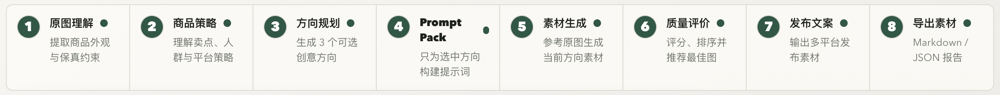
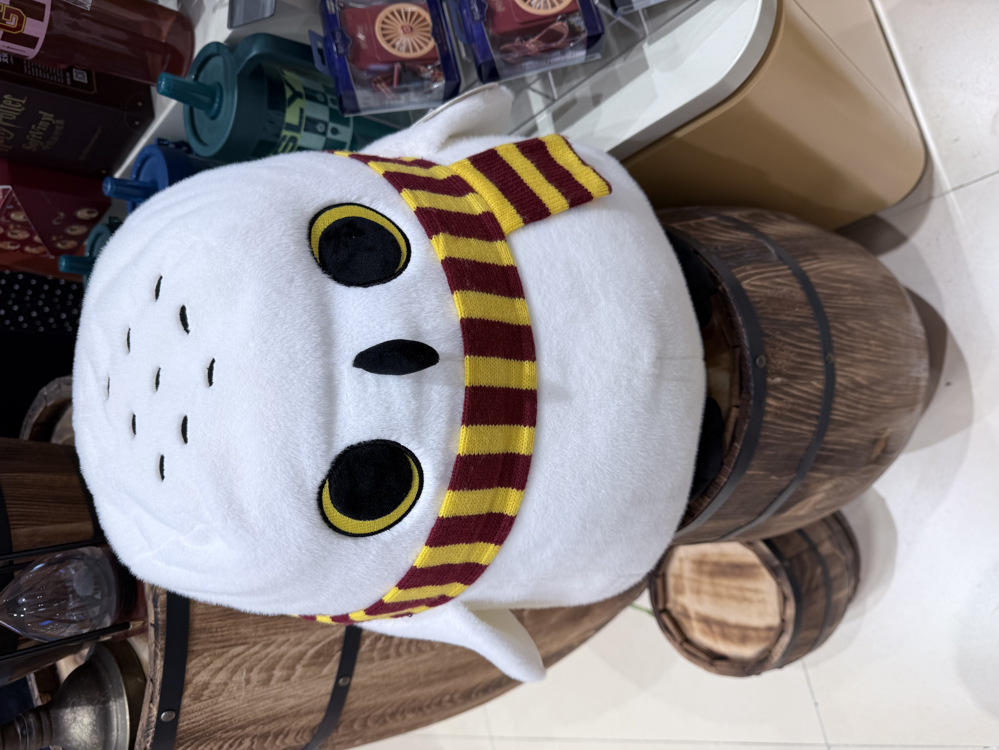
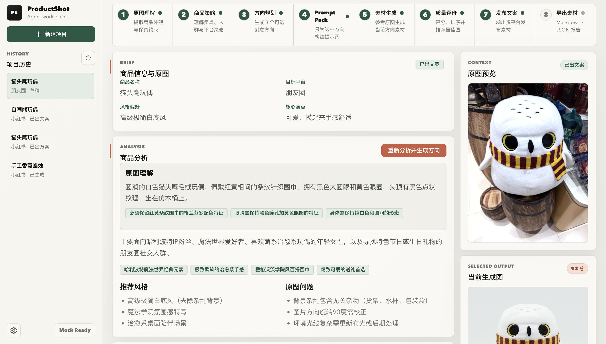
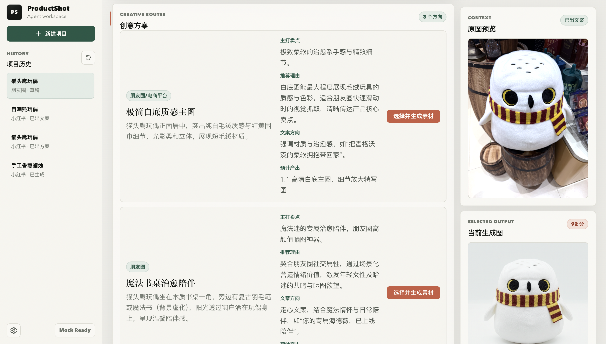
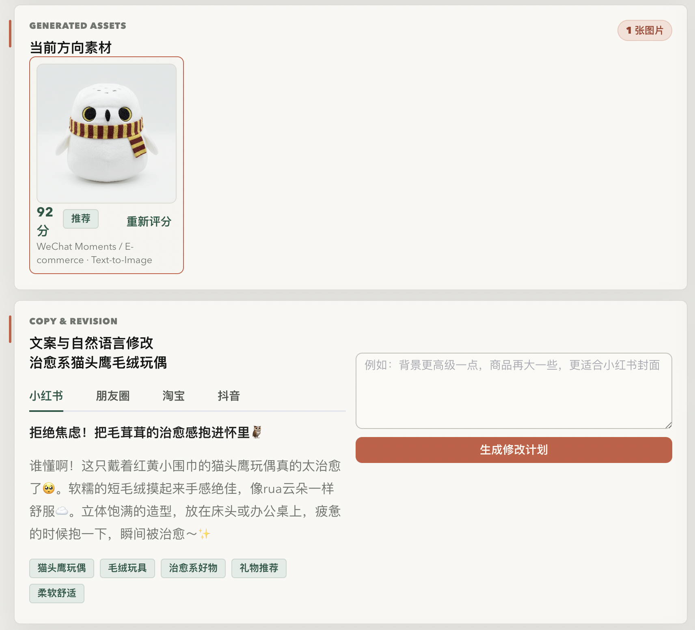
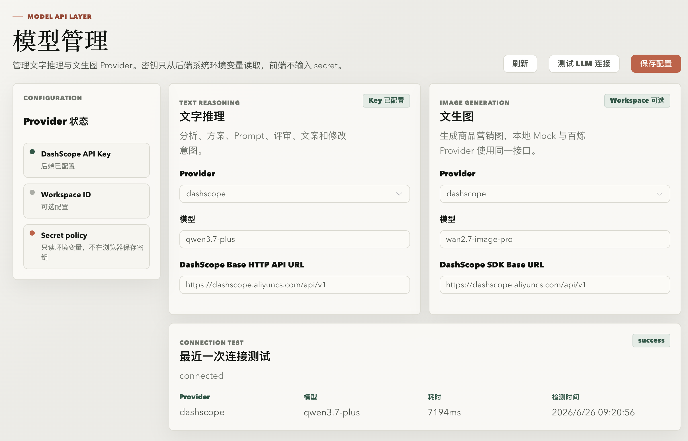
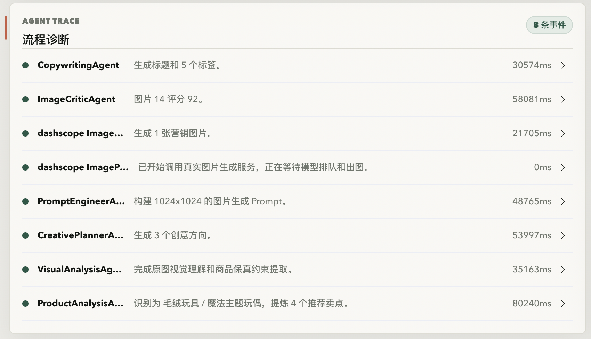
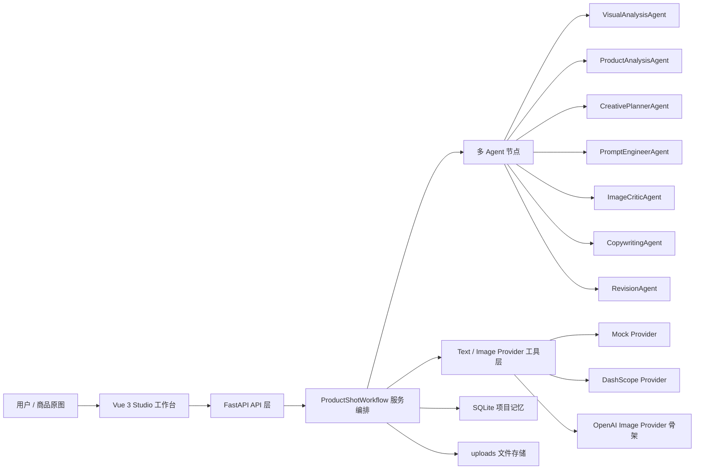

# ProductShot Agent

面向轻量商家的 AI 商品营销素材生产工作台。它把“普通商品原图”转化为“可发布营销素材包”：原图理解、商品策略、创意方案、图片生成、质量评分、多平台文案、自然语言修改和 Markdown / JSON 导出都在同一个项目上下文中完成。

> 项目定位：不是单点图片生成器，而是围绕“小商家商品内容生产”的多 Agent 工作流系统。


## 1. 项目简介

ProductShot 的核心价值是把原本分散的 AI 出图、提示词编写、图片评价和平台文案生成，收敛成一条可运行的商品素材生产线。

- 面向对象：淘宝、朋友圈、小红书、抖音等轻量商家和个体卖家。
- 输入材料：一张商品原图 + 少量商品信息。
- 输出结果：营销图、评分推荐、多平台文案、修改计划和素材报告。
- 工程重点：多 Agent 编排、Provider 工具抽象、项目级 Memory、流程可观测性。

## 2. 项目背景

轻量商家的真实痛点不是“有没有 AI 出图工具”，而是“从一张随手拍商品图到可发布素材”的整条链路没有被打通。

| 真实问题 | ProductShot 的解决方式 |
| --- | --- |
| 原图背景杂乱、主体不突出 | 先做原图视觉理解，提取商品外观、材质、背景问题和保真约束 |
| 不会选择视觉方向 | 先生成 3 个创意方向，让用户比较后再生成图片 |
| 不会写提示词 | Prompt Agent 根据选中方向生成 Prompt Pack 和负向约束 |
| 不知道生成图能不能发布 | Image Critic 从商品一致性、清晰度、商业价值和平台适配度评分 |
| 图片和文案割裂 | Copywriting Agent 基于商品策略、创意方向和推荐图生成多平台文案 |
| 模型调用慢、失败难定位 | workflow_events 记录每个 Agent / Provider 的状态、耗时、摘要和详情 |

## 3. 项目演示

### 3.1 Step 0：整体生产流程

**功能**：工作流被拆成 8 个可追踪阶段：原图理解、商品策略、方向规划、Prompt Pack、素材生成、质量评价、发布文案和导出素材。

**效果**：面试官可以一眼看出这个项目不是简单调用图片模型，而是覆盖从商品输入到最终发布素材的完整链路。



### 3.2 Step 1：首页与项目入口

**功能**：首页提供新建项目、最近项目和项目历史入口，用户可以快速回到已有商品素材生产任务。

**效果**：项目不是一次性 Demo 页面，而是围绕“项目”组织状态、素材、文案和历史结果。


### 3.3 Step 2：原图到营销图

**功能**：用户上传普通商品原图，系统根据商品分析和选中方向生成更适合平台发布的营销图。

**效果**：生成图保留白色毛绒主体、黑黄眼睛和红黄围巾等关键特征，同时去掉杂乱背景，形成更干净的商品展示画面。

<table>
  <tr>
    <th>原始商品图</th>
    <th>生成效果图</th>
  </tr>
  <tr>
    <td></td>
    <td></td>
  </tr>
</table>

### 3.4 Step 3：原图理解与商品策略

**功能**：VisualAnalysisAgent 读取原图，提取外观、材质、背景问题和保真约束；ProductAnalysisAgent 再结合商品信息生成卖点、人群和平台策略。

**效果**：后续 Prompt、生成图评分和文案都能复用同一份商品上下文，避免图片好看但商品主体失真。



### 3.5 Step 4：创意方向规划

**功能**：CreativePlannerAgent 生成 3 个可选营销方向，每个方向包含画面描述、主打卖点、推荐理由、文案方向和预期产出。

**效果**：用户先比较方向，再决定生成哪一路素材，降低盲目出图成本。



### 3.6 Step 5：素材生成、评分与文案

**功能**：PromptEngineerAgent 为选中方向构建 Prompt Pack；ImageProvider 生成图片；ImageCriticAgent 评分并推荐最佳图；CopywritingAgent 生成多平台发布文案。

**效果**：系统输出的不只是图片，还包括评分依据、推荐图、平台文案和标签，形成可发布素材包。



### 3.7 Step 6：模型管理

**功能**：前端只允许调整文字推理 Provider、图片生成 Provider、模型名和 Base URL 等非敏感配置；API Key 始终从后端系统环境变量读取。

**效果**：既方便本地切换 Mock / DashScope Provider，也避免把 secret 暴露给浏览器或提交到仓库。



### 3.8 Step 7：Agent Trace 流程诊断

**功能**：每个 Agent / Provider 节点都会记录状态、耗时、摘要和结构化详情。

**效果**：模型调用慢、图片生成排队、评分失败、文案异常等问题可以在页面上定位，而不是只能翻后端日志。



## 4. 核心功能

1. 项目工作台：创建商品项目，填写商品名称、类别、卖点、目标平台、目标人群和风格偏好。
2. 原图理解：识别商品外观、主色、材质、可见文字、背景问题和保真约束。
3. 商品策略：结合用户输入与视觉分析，提炼人群、卖点、平台策略和视觉方向。
4. 创意规划：生成 3 个可选营销方向，用户选择后再进入图片生成。
5. Prompt Pack：为选中方向生成正向提示词、负向约束、尺寸和商品一致性要求。
6. 图片生成：通过 Mock / DashScope / OpenAI Provider 抽象调用图片模型。
7. 质量评价：对生成图进行商品清晰度、商品一致性、风格匹配、商业价值和平台适配评分。
8. 文案生成：生成标题、卖点、小红书、朋友圈、淘宝、抖音文案和标签。
9. 自然语言修改：将用户修改意图分类为文案、平台、Prompt、风格、创意方案或图片修改。
10. 导出报告：导出 Markdown / JSON 素材报告。

## 5. 技术架构



| 模块 | 技术与职责 |
| --- | --- |
| 前端 | Vue 3, TypeScript, Vite, Pinia, Vue Router, Element Plus；承载连续式 Studio 工作台 |
| 后端 | FastAPI, SQLAlchemy, SQLite, Pydantic；负责 API、校验、持久化和报告导出 |
| Workflow | `ProductShotWorkflow` 编排 Agent、Provider、状态流转和 workflow_events |
| Agent 层 | 视觉理解、商品策略、创意规划、Prompt、评分、文案和修改意图 |
| Tool / Provider 层 | `TextProvider` 与 `ImageProvider` 抽象，隔离 Mock、DashScope 和 OpenAI |
| Memory | SQLite 保存项目、原图、分析结果、方案、生成图、评分、文案和流程事件 |

## 6. Agent 工作流设计

```text
创建项目
  -> 上传商品原图
  -> VisualAnalysisAgent：提取商品外观、背景问题和保真约束
  -> ProductAnalysisAgent：生成商品策略、卖点、人群和平台策略
  -> CreativePlannerAgent：生成 3 个可选创意方向
  -> 用户选择方向
  -> PromptEngineerAgent：构建 Prompt Pack
  -> ImageProvider：生成营销图片
  -> ImageCriticAgent：评分、排序并推荐最佳图
  -> CopywritingAgent：生成多平台发布文案
  -> RevisionAgent：解析自然语言修改意图
  -> 导出 Markdown / JSON 报告
```

Agent 设计原则：

1. **职责单一**：每个 Agent 只处理一个明确节点，输出结构化 Pydantic Schema。
2. **人机协同**：先生成多个方向，关键决策由用户选择，而不是全自动黑盒出图。
3. **保真优先**：视觉分析阶段提取商品一致性规则，后续 Prompt 和评分都复用这些约束。
4. **可降级运行**：真实模型不可用时，Mock Provider 和 fallback 逻辑仍能跑完整流程。

## 7. Tool Use 设计

本项目没有把外部能力散落在 Agent 代码里，而是通过 Provider 抽象把“工具调用”收敛成可替换接口：

| Tool / Provider | 输入 | 输出 | 设计目的 |
| --- | --- | --- | --- |
| `TextProvider.generate_json` | system prompt、user prompt、schema name | 结构化 JSON | 统一文字推理、策略、文案和评分输出 |
| `generate_multimodal_json` | prompt + 图片路径 | 结构化视觉理解 / 评分 | 支持原图理解和生成图质量评价 |
| `ImageProvider.generate_images` | source image、positive prompt、negative prompt、size、count | 本地图片文件与 URL | 隔离 Mock、DashScope、OpenAI 等图片生成实现 |
| `WorkflowEvent` 记录 | step、agent、status、detail、latency | 可视化流程诊断 | 让工具调用过程可追踪、可排错 |

关键处理：

1. 图片 Provider 声明 `capabilities`，当 Prompt 要求图生图但 Provider 不支持时，后端会明确报错。
2. DashScope 图片生成采用异步任务创建、轮询、下载落盘的方式，避免把外部模型状态隐藏在前端。
3. API Key 只从后端环境变量读取，前端模型管理页不保存 secret。

## 8. Memory 设计

本项目的 Memory 不是向量数据库或长期用户画像，而是面向生产工作流的项目级记忆：

| Memory 类型 | 存储内容 | 作用 |
| --- | --- | --- |
| Project Memory | 商品信息、目标平台、人群、风格偏好 | 保证后续 Agent 使用同一项目上下文 |
| Visual Memory | 原图理解、材质、背景问题、保真约束、人工审核意见 | 让 Prompt 和评分持续遵守商品一致性 |
| Creative Memory | 3 个创意方向及用户选中的方向 | 避免生成、评分、文案脱离用户选择 |
| Asset Memory | 原图、生成图、评分、推荐图、文案 | 支持回看、导出和继续修改 |
| Trace Memory | workflow_events 中的节点状态、耗时、摘要和详情 | 支持问题排查与流程可观测性 |

这种设计的重点是“让多步 Agent 工作流有上下文和可追踪状态”，而不是为了技术展示强行引入 RAG。

## 9. 核心技术亮点

### 9.1 问题：单次图片生成无法覆盖真实营销链路

**方案**：将流程拆成“先分析与规划，再选择方向生成素材包”的两阶段工作流。

**效果**：用户能先比较创意方向，再决定是否生成图片；生成图、评分、文案和导出都绑定到同一个项目上下文，形成完整业务闭环。

### 9.2 问题：LLM 输出容易散、难以进入工程流程

**方案**：所有 Agent 输出都落到 Pydantic Schema，例如 `VisualAnalysisPayload`、`ProductAnalysisPayload`、`PromptPackPayload`、`ImageReviewPayload`。

**效果**：后端可以稳定持久化、复用和展示 Agent 输出，前端也能按固定字段渲染分析、标签、评分和文案。

### 9.3 问题：图片生成模型调用慢、失败原因难定位

**方案**：将模型能力封装为 Provider，并持久化记录每个 Agent / Provider 节点的状态、耗时、摘要、错误和结构化详情。

**效果**：用户能在页面看到流程进度和 Agent Trace；开发时也能快速判断问题出在 Prompt、图片生成、评分还是文案节点。

### 9.4 问题：AI 生成图可能改变商品主体

**方案**：在原图理解阶段提取商品保真约束，并在 Prompt Pack 和 Image Critic 中持续使用这些约束。

**效果**：系统不仅追求“图片好看”，还会关注商品主体是否清晰、是否变形、是否保留关键颜色/标签/材质。

### 9.5 问题：真实模型接入与本地演示容易互相阻塞

**方案**：默认使用 Mock Provider 跑通完整流程，真实 DashScope Provider 通过环境变量切换。

**效果**：没有 API Key 时也能演示产品闭环；接入真实模型时无需改业务流程，只替换 Provider。

## 10. 项目难点与解决方案

| 难点 | 解决方案 | 可面试讲解点 |
| --- | --- | --- |
| 多 Agent 输出需要串成稳定业务流 | 服务层统一编排，Agent 输出全部结构化 | 为什么不让 LLM 直接生成整份结果，而是拆节点 |
| 商品保真比图片美观更重要 | 原图理解提取保真约束，Prompt 和评分复用 | 商品图生成与普通文生图的差异 |
| 真实模型慢且不稳定 | 前端进度、后端 timeout、workflow_events 共同处理 | LLM 应用的可观测性与降级设计 |
| 前端流程容易割裂 | 统一 `/studio` 工作台，旧路由重定向 | 如何把多步工作流设计成连续体验 |
| Key 与模型配置安全 | Key 只读后端环境变量，前端只调非敏感配置 | AI 应用中的 secret 边界 |

## 11. 快速开始

### 11.1 启动后端

```bash
cd backend
python3 -m venv .venv
source .venv/bin/activate
pip install -r requirements.txt
uvicorn app.main:app --reload
```

后端默认运行在 `http://127.0.0.1:8000`，API 文档在 `http://127.0.0.1:8000/docs`。

### 11.2 启动前端

```bash
cd frontend
npm install
npm run dev
```

前端默认运行在 `http://127.0.0.1:5173`。

### 11.3 默认 Mock 流程

默认情况下不需要真实模型 Key。Mock Provider 会复制上传原图或生成占位图，并返回结构化的分析、方案、评分和文案，适合本地演示完整产品闭环。

### 11.4 可选：接入 DashScope

```bash
export TEXT_PROVIDER=dashscope
export IMAGE_PROVIDER=dashscope
export TEXT_MODEL=qwen3.7-plus
export DASHSCOPE_IMAGE_MODEL=wan2.7-image-pro
export DASHSCOPE_BASE_HTTP_API_URL=https://dashscope.aliyuncs.com/api/v1
export DASHSCOPE_API_KEY=your_api_key
```

注意：不要把真实 Key、个人专属 Base URL、Workspace ID、业务空间地址写入 `.env`、README、代码、测试或前端请求中。当前前端模型管理页只展示 Key 是否已在后端配置，并允许调整非敏感模型参数。

## 12. 验证方式

后端测试：

```bash
cd backend
pytest -q
```

前端构建：

```bash
cd frontend
npm run build
```

建议的手动验证路径：

1. 打开 `/studio`，创建商品项目并上传图片。
2. 运行原图理解，检查商品外观、材质、背景问题和保真约束。
3. 确认或修正原图理解结果后生成商品策略和 3 个创意方向。
4. 选择一个创意方向生成素材包。
5. 查看生成图、质量评分、推荐图、多平台文案和流程诊断。
6. 输入自然语言修改要求，最后导出 Markdown / JSON 报告。

## 13. 项目结构

```text
.
├── backend/
│   ├── app/
│   │   ├── agents/        # 商品分析、创意、Prompt、评分、文案、修改 Agent
│   │   ├── api/           # FastAPI 路由
│   │   ├── providers/     # Text / Image Provider 抽象与实现
│   │   ├── services/      # 工作流编排
│   │   ├── storage/       # 上传文件保存
│   │   └── models/        # SQLAlchemy 数据模型
│   └── tests/
├── frontend/
│   └── src/
│       ├── views/         # 首页、项目工作台、模型管理
│       ├── stores/        # 项目流程状态
│       └── api/           # 后端 API Client
└── docs/
    ├── PRD.md
    └── assets/
```

## 14. 当前边界

- 这是本地 MVP，不是生产级 SaaS。
- 默认 Mock 图片生成不代表真实商品图生成质量，只用于验证产品流程。
- 真实图片生成质量取决于所接入模型、原图质量、提示词和平台限制。
- OpenAI 图片 Provider 当前是扩展骨架，真实生产接入仍需要补齐模型调用和异常处理。
- 图片主体一致性、版权风险、平台合规、批量导出、账号体系和权限控制仍需要继续完善。
- 数据默认存储在本地 SQLite 和 uploads 目录，暂未实现云端存储。

## 15. 后续规划

- 补强图片生成任务的失败重试、状态解释和版本对比。
- 增加生成结果收藏、重生成、A/B 对比和批量导出。
- 支持更多平台尺寸和导出模板。
- 扩展工作流测试，覆盖 Agent 输出结构、Provider 降级和导出报告。
- 继续优化真实模型下的商品一致性评价与局部重绘能力。

## 16. 相关文档

- [产品需求文档](docs/PRD.md)
- [后端说明](backend/README.md)
- [前端说明](frontend/README.md)
