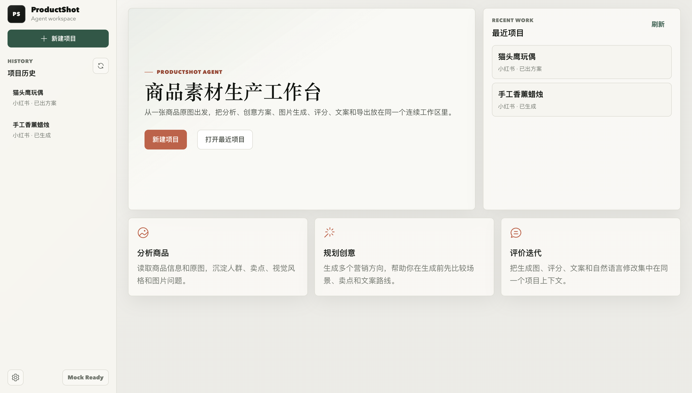
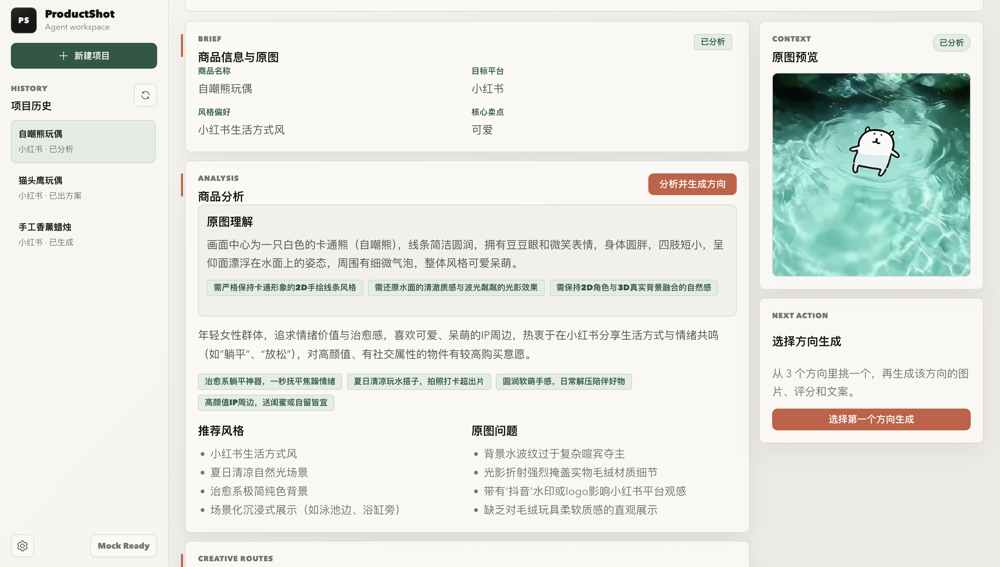

# ProductShot Agent

面向商家的 AI 商品营销素材生产工作台。

ProductShot Agent ：把一张商品原图转化为可发布营销素材包的两段式工作流：先理解原图和商品信息，给出 3 个可选创意方向；用户选择方向后，再生成营销图、质量评分、平台文案、自然语言修改和导出素材。

当前项目处于 MVP 开发阶段，重点验证的是：小商家能否用很少的商品信息和一张普通原图，快速获得一组更适合小红书、朋友圈、淘宝等平台发布的营销素材。





## 为什么做这个项目

很多轻量商家并不缺商品，而是缺少可持续生产营销内容的能力：

- 原图背景杂乱、质感不足，不适合直接发布。
- 不知道怎么提炼卖点、写平台文案、选择视觉风格。
- 直接用图片生成工具时，需要反复写提示词、出图、判断效果。
- 生成结果缺少评分、修改依据和可追踪的项目上下文。

ProductShot Agent 希望把这些分散步骤收敛成一个更像“商品素材生产线”的应用：确定性逻辑负责项目、文件、流程和导出，LLM 负责商品理解、创意方案、Prompt、评分、文案和修改意图。

## 当前已实现

- 项目工作台：创建商品项目，填写商品名称、类别、卖点、目标平台、目标人群和风格偏好。
- 商品图上传：支持 JPG、PNG、WebP，并将原图作为视觉理解和图生图/参考图生成的统一素材源。
- 多 Agent 工作流：
  - `VisualAnalysisAgent`：理解原图外观、材质、包装/Logo、背景问题和商品保真约束。
  - `ProductAnalysisAgent`：结合用户文字和视觉分析，形成商品策略、人群、卖点和平台适配。
  - `CreativePlannerAgent`：生成 3 个可选营销创意方向。
  - `PromptEngineerAgent`：只为用户选中的方向构建 Prompt Pack。
  - `ImageCriticAgent`：从商品一致性、主体清晰度、风格匹配、商业价值、平台适配等维度评分并推荐最佳图。
  - `CopywritingAgent`：生成标题、卖点、小红书、朋友圈、淘宝文案和标签。
  - `RevisionAgent`：把自然语言修改要求转成新的修改计划和 Prompt。
- 图片生成 Provider：默认 Mock Provider 可本地跑完整流程，也预留 DashScope / OpenAI 图片生成 Provider。
- 文字模型 Provider：默认 Mock Provider；可通过后端环境变量切换到 DashScope SDK。
- 流程诊断：记录每个 Agent / Provider 节点的状态、摘要、耗时、错误和结构化详情，方便排查。
- 导出：支持导出 Markdown 和 JSON 素材报告。
- 模型管理页：前端只调整非敏感模型配置；API Key 只从后端环境变量读取，不在浏览器输入或保存。

## MVP 工作流

```text
创建项目
  -> 上传商品原图
  -> 原图理解与商品策略
  -> 生成 3 个创意方向
  -> 用户选择一个方向
  -> 生成该方向的图片、评分和推荐图
  -> 生成平台文案与发布素材
  -> 自然语言修改
  -> 导出素材报告
```

默认情况下不需要真实模型 Key：Mock Provider 会复制上传原图或生成占位图，并返回结构化的分析、方案、评分和文案，便于演示完整产品闭环。

## 技术栈

| 模块 | 技术 |
| --- | --- |
| 前端 | Vue 3, TypeScript, Vite, Pinia, Vue Router, Element Plus |
| 后端 | FastAPI, SQLAlchemy, SQLite, Pydantic |
| 工作流 | 服务层编排多个 Agent，Provider 层隔离文字模型和图片生成模型 |
| 存储 | 本地 SQLite + uploads 文件目录 |
| 模型接入 | Mock, DashScope；OpenAI 图片 Provider 骨架预留 |

## 项目结构

```text
.
├── backend/
│   ├── app/
│   │   ├── agents/        # 商品分析、创意、Prompt、评分、文案、修改 Agent
│   │   ├── api/           # FastAPI 路由
│   │   ├── providers/     # Text / Image Provider 抽象与实现
│   │   ├── services/      # 工作流编排
│   │   ├── storage/       # 上传文件保存
│   │   └── models/        # SQLAlchemy 数据模型
│   └── tests/
├── frontend/
│   └── src/
│       ├── views/         # 首页、项目工作台、模型管理
│       ├── stores/        # 项目流程状态
│       └── api/           # 后端 API Client
└── docs/
    ├── PRD.md
    └── assets/
```

## 快速启动

### 1. 启动后端

```bash
cd backend
python3 -m venv .venv
source .venv/bin/activate
pip install -r requirements.txt
uvicorn app.main:app --reload
```

后端默认运行在 `http://127.0.0.1:8000`，API 文档在 `http://127.0.0.1:8000/docs`。

### 2. 启动前端

```bash
cd frontend
npm install
npm run dev
```

前端默认运行在 `http://127.0.0.1:5173`。

## 可选：接入 DashScope

MVP 默认使用 Mock Provider。如果要在本地测试真实文字推理或图片生成，可以通过环境变量切换：

```bash
export TEXT_PROVIDER=dashscope
export IMAGE_PROVIDER=dashscope
export TEXT_MODEL=qwen3.7-plus
export DASHSCOPE_IMAGE_MODEL=wan2.7-image-pro
export DASHSCOPE_BASE_HTTP_API_URL=https://ws-k524juxb6rhpyhlp.cn-beijing.maas.aliyuncs.com/api/v1
export DASHSCOPE_API_KEY=your_api_key
```

注意：不要把真实 Key 写入 `.env`、README、代码或前端请求中。当前前端模型管理页只展示 Key 是否已在后端配置，并允许调整非敏感模型参数。

更多后端配置见 [backend/README.md](backend/README.md)。

## 开发与验证

后端测试：

```bash
cd backend
pytest -q
```

前端构建：

```bash
cd frontend
npm run build
```

建议的手动验证路径：

1. 打开首页，创建一个商品项目。
2. 上传一张商品图片。
3. 运行“分析与方案”。
4. 选择一个创意方案生成素材。
5. 查看图片评分、平台文案和流程诊断。
6. 输入自然语言修改要求，并导出 Markdown / JSON 报告。

## 当前边界

- 仍是本地 MVP，不是生产级 SaaS。
- 默认 Mock 图片生成不代表真实商品图生成质量，只用于验证产品流程。
- OpenAI 图片 Provider 目前是骨架预留，真实生产接入仍需要补齐模型调用和异常处理。
- 图片主体一致性、版权风险、平台合规和批量导出仍需要继续完善。
- 数据默认存储在本地 SQLite 和 uploads 目录，暂未实现云端存储、账号体系和权限控制。

## 下一步计划

- 补强真实图片生成 Provider 的状态查询、失败重试和错误解释。
- 增加生成结果选择、收藏、重生成和版本对比。
- 支持更多平台尺寸与导出模板。
- 增加端到端演示数据和截图，降低作品展示时的理解成本。
- 完善工作流测试，覆盖 Agent 输出结构、Provider 降级和导出报告。

## 相关文档

- [产品需求文档](docs/PRD.md)
- [后端说明](backend/README.md)
- [前端说明](frontend/README.md)
